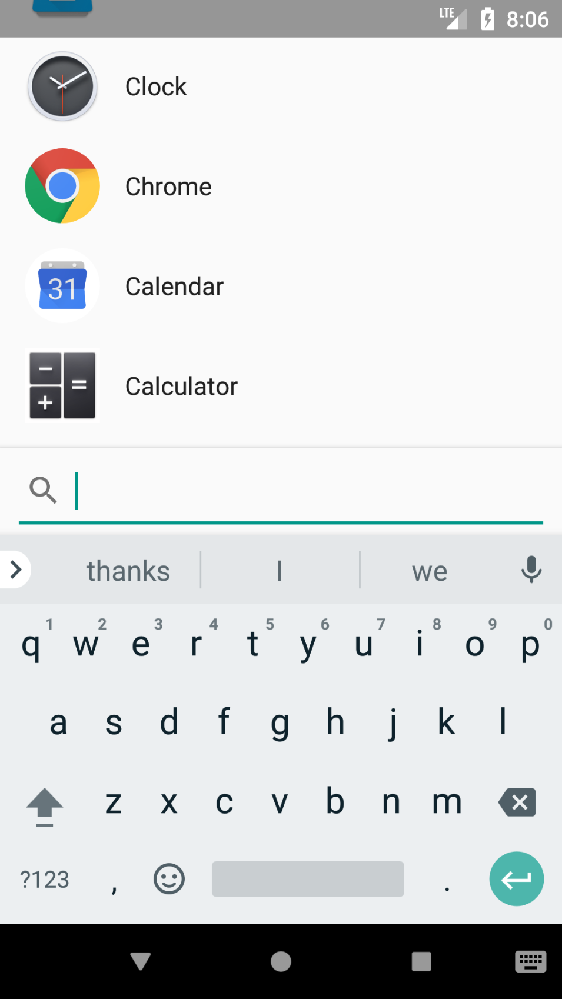
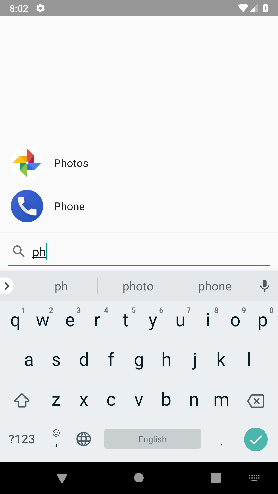

# rLauncher

Keyboard-based launcher app for Android. Type to filter the list of apps, and
when only one app matches the query, it will be launched automatically.

rLauncher requires no permissions, and has an APK size of < 200 KB. There is no
support for widgets or wallpapers, it does one thing: launch apps.

## Screenshots

License
-------

    Copyright 2018 Rashad Sookram

    Licensed under the Apache License, Version 2.0 (the "License");
    you may not use this file except in compliance with the License.
    You may obtain a copy of the License at

       http://www.apache.org/licenses/LICENSE-2.0

    Unless required by applicable law or agreed to in writing, software
    distributed under the License is distributed on an "AS IS" BASIS,
    WITHOUT WARRANTIES OR CONDITIONS OF ANY KIND, either express or implied.
    See the License for the specific language governing permissions and
    limitations under the License.
